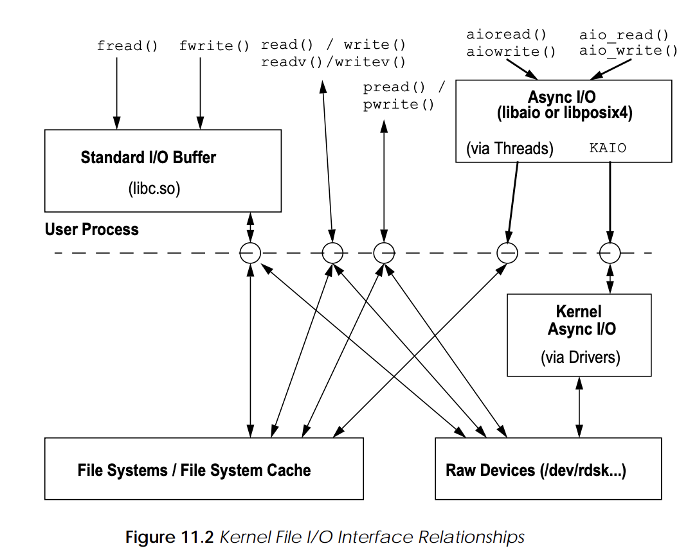

# Errno in pthreads
Single thread - global int, multi thread - macro

http://src.illumos.org/source/xref/illumos-gate/usr/src/head/errno.h?r=acab0a4f
```C
#if defined(_REENTRANT) || defined(_TS_ERRNO) || _POSIX_C_SOURCE - 0 >= 199506L
    extern int *___errno();
    #define	errno (*(___errno()))
#else
    extern int errno;
    /* ANSI C++ requires that errno be a macro */
    #if __cplusplus >= 199711L
        #define	errno errno
    #endif
#endif
```
http://src.illumos.org/source/xref/illumos-gate/usr/src/lib/libc/port/gen/errno.c?r=8cd45542#36
```C
int *
___errno()
{
    return (curthread->ul_errnop);
}
```

Returns lvalue of current thread errno

# Async IO

> So, at the end that leaves POSIX AIO in the position of not serving any useful purpose. Don't use it.

* kqueue
* epoll
* IO completion ports

## Why?
1. Threads are expensive and are executed randomly
2. Select/poll is not always the right approach (some devices send data only after explicit request)

## Implementations
1. *POSIX* (has _)
2. Solaris aio (hasn't _)

## How to use
aiocb: 
```
int               aio_fildes       file descriptor
off_t             aio_offset       file offset
volatile void*    aio_buf          location of buffer
size_t            aio_nbytes       length of transfer
int               aio_reqprio      request priority offset
struct sigevent   aio_sigevent     notification type
int               aio_lio_opcode   listio operation
```

Methods:
1. `int aio_read(struct aiocb *aiocbp);`
2. `int aio_write(struct aiocb *aiocbp);`
3. `int aio_suspend(const struct aiocb * const aiocb_list[],int nitems, const struct timespec *timeout);` aka poll/Promise.any
4. `int aio_cancel(int fd, struct aiocb *aiocbp);`
5. `int aio_error(const struct aiocb *aiocbp);` and `ssize_t aio_return(struct aiocb *aiocbp);`
6. `int lio_listio(int mode, struct aiocb *const aiocb_list[], int nitems, struct sigevent *sevp);`

Notifications:

1. Send SIGIO when request is complete.

## Implementation details


http://src.illumos.org/source/xref/illumos-gate/usr/src/lib/libc/port/aio/posix_aio.c?r=75e1bcde#66
```C
int
aio_read(aiocb_t *aiocbp)
{
	if (aiocbp == NULL || aiocbp->aio_reqprio != 0) {
		errno = EINVAL;
		return (-1);
	}
	if (_aio_hash_find(&aiocbp->aio_resultp) != NULL) {
		errno = EBUSY;
		return (-1);
	}
	if (_aio_sigev_thread(aiocbp) != 0)
		return (-1);
	aiocbp->aio_lio_opcode = LIO_READ;
	return (_aio_rw(aiocbp, NULL, &__nextworker_rw, AIOAREAD,
	    (AIO_KAIO | AIO_NO_DUPS)));
}
```
http://src.illumos.org/source/xref/illumos-gate/usr/src/lib/libc/port/aio/aio.c?r=bced1f33&fi=_aio_rw#2118

Try to use KAIO, if it is not available fallback to thread implementation

If kaio support is available, here’s what happens:
1. The kernel allocates an aio_req structure from the queue (or creates a new
one in kernel memory with kmem_alloc) and calls the async I/O routine in
the appropriate device driver.
2. Inside the driver, the required kernel data structures are set up to support
the I/O, and an async-I/O-specific physical I/O routine, aphysio, is entered.
3. Synchronous raw device I/O uses the kernel physio function, whereby kernel buffers are set up, and the driver strategy routine is called to do the
actual device I/O.
4. The physio routine waits for the driver strategy routine to complete through
the buffer I/O biowait() kernel code.
5. The aphysio routine sets up the async I/O support structures and signal
mechanism, then calls the driver strategy routine without waiting for the I/O
to complete.

`_kaio`

http://src.illumos.org/source/xref/illumos-gate/usr/src/uts/common/os/aio.c?r=8ab00936&mo=7078&fi=302#302

`arw`

...